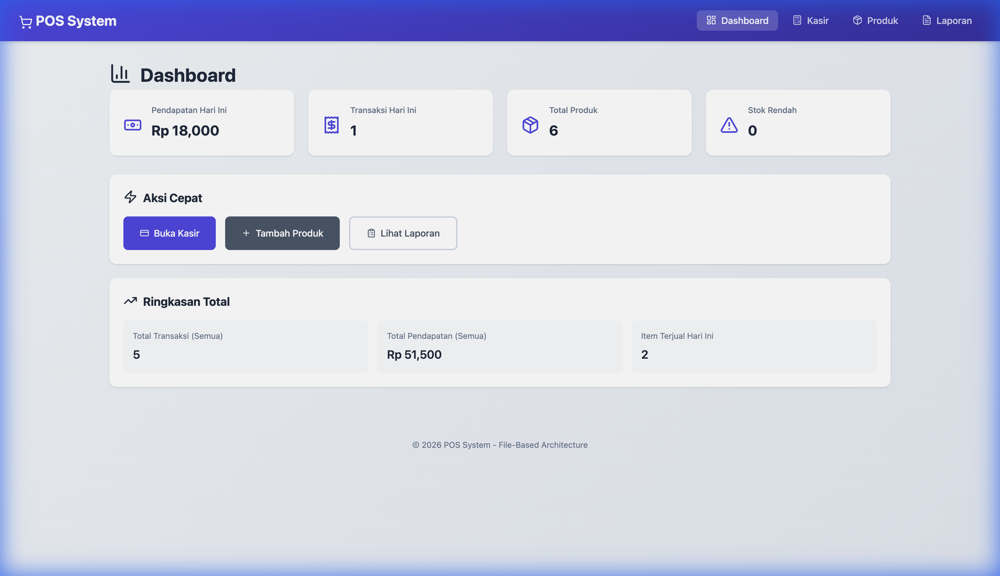
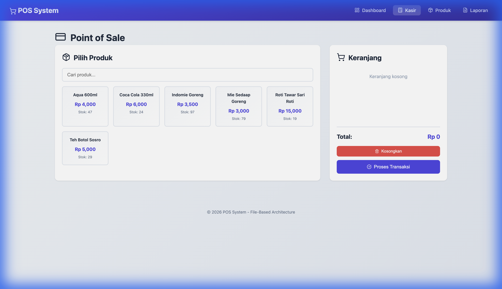
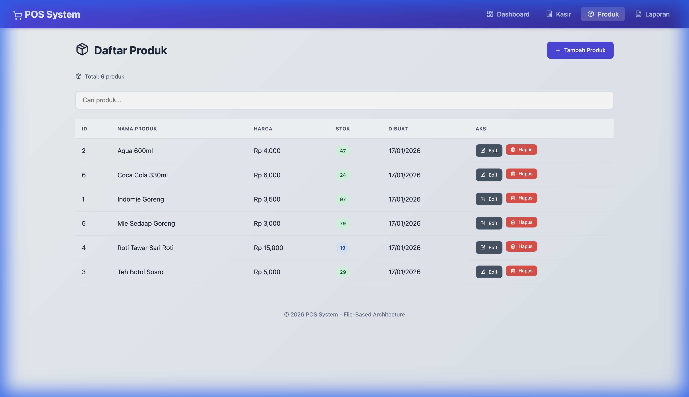
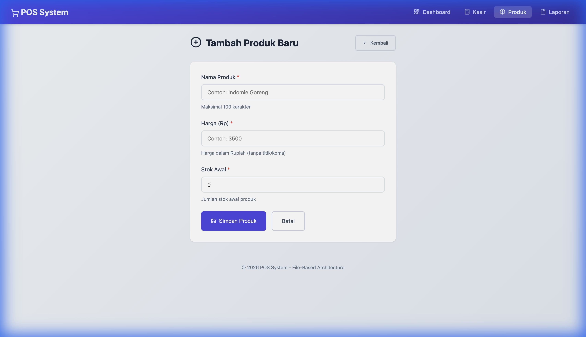
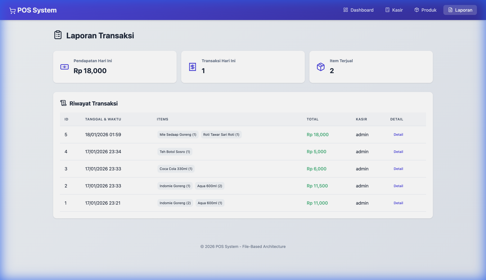

# POS System - Point of Sale Web Application

Aplikasi **Point of Sale (POS)** berbasis web yang dibangun menggunakan FastAPI dengan arsitektur berlapis (layered architecture). Menggunakan file `.txt` sebagai data storage (file-based storage).

## Fitur

- **Dashboard** - Menampilkan statistik penjualan, total produk, stok rendah, dan ringkasan transaksi
- **Manajemen Produk** - CRUD produk (tambah, edit, hapus, lihat daftar)
- **Kasir (POS)** - Interface untuk proses transaksi penjualan
- **Laporan Transaksi** - Riwayat transaksi dan detail struk
- **API RESTful** - Endpoint API dengan dokumentasi Swagger

## Teknologi

- **Backend**: Python 3.10+, FastAPI
- **Frontend**: HTML, CSS, Jinja2 Templates
- **Icons**: Lucide Icons
- **Storage**: File-based (.txt)

## Struktur Project

```
pos-web/
├── app/
│   ├── data/                  # Data storage (.txt files)
│   │   ├── stok.txt           # Data produk
│   │   └── laporan_penjualan.txt  # Data transaksi
│   ├── repositories/          # Layer akses data
│   ├── routes/                # API & Page routes
│   ├── schemas/               # Pydantic models
│   ├── services/              # Business logic
│   ├── static/                # CSS, JS, images
│   ├── templates/             # HTML templates
│   ├── utils/                 # Utility functions
│   └── main.py                # Entry point
├── venv/                      # Virtual environment
├── requirements.txt           # Dependencies
└── README.md                  # Dokumentasi
```

## Instalasi

### 1. Clone atau Download Project

```bash
cd pos-web
```

### 2. Buat Virtual Environment

```bash
# Buat virtual environment
python3 -m venv venv

# Aktifkan virtual environment
# MacOS/Linux:
source venv/bin/activate

# Windows:
venv\Scripts\activate
```

### 3. Install Dependencies

```bash
pip install -r requirements.txt
```

## Menjalankan Aplikasi

### Cara 1: Menggunakan Uvicorn (Recommended)

```bash
cd app
source ../venv/bin/activate  # Aktifkan venv jika belum
uvicorn main:app --reload --port 8000
```

### Cara 2: Menggunakan Python

```bash
cd app
source ../venv/bin/activate
python main.py
```

### Troubleshooting: Port Already in Use

Jika muncul error `Address already in use`, jalankan:

```bash
# Kill proses yang menggunakan port 8000
lsof -ti:8000 | xargs kill -9

# Jalankan ulang
uvicorn main:app --reload --port 8000
```

Atau gunakan port lain:

```bash
uvicorn main:app --reload --port 8001
```

## Akses Aplikasi

Setelah server berjalan, buka browser:

| Halaman           | URL                                |
| ----------------- | ---------------------------------- |
| Dashboard         | http://localhost:8000/             |
| Kasir (POS)       | http://localhost:8000/pos          |
| Daftar Produk     | http://localhost:8000/products     |
| Tambah Produk     | http://localhost:8000/products/add |
| Laporan Transaksi | http://localhost:8000/transactions |
| API Documentation | http://localhost:8000/docs         |
| ReDoc             | http://localhost:8000/redoc        |

## API Endpoints

### Products

| Method | Endpoint             | Deskripsi           |
| ------ | -------------------- | ------------------- |
| GET    | `/api/products`      | Daftar semua produk |
| GET    | `/api/products/{id}` | Detail produk       |
| POST   | `/api/products`      | Tambah produk baru  |
| PUT    | `/api/products/{id}` | Update produk       |
| DELETE | `/api/products/{id}` | Hapus produk        |

### Transactions

| Method | Endpoint                         | Deskripsi           |
| ------ | -------------------------------- | ------------------- |
| GET    | `/api/transactions`              | Daftar transaksi    |
| GET    | `/api/transactions/{id}`         | Detail transaksi    |
| POST   | `/api/transactions`              | Buat transaksi baru |
| GET    | `/api/transactions/report/today` | Laporan hari ini    |

### Health Check

| Method | Endpoint  | Deskripsi       |
| ------ | --------- | --------------- |
| GET    | `/health` | Status aplikasi |

## Format Data

### stok.txt (Products)

```
id|nama|harga|stok|created_at
1|Indomie Goreng|3500|100|2026-01-17 10:00:00
2|Aqua 600ml|4000|50|2026-01-17 10:00:00
```

### laporan_penjualan.txt (Transactions)

```
id|tanggal|items|total|kasir
TRX001|2026-01-17 14:30:00|[{"product_id":1,"nama":"Indomie","qty":2,"harga":3500,"subtotal":7000}]|7000|admin
```

## Screenshots

### Dashboard

Halaman utama yang menampilkan ringkasan statistik bisnis.



**Fitur:**

- Statistik pendapatan hari ini
- Jumlah transaksi hari ini
- Total produk tersedia
- Alert stok rendah
- Quick action buttons
- Ringkasan total keseluruhan

---

### Kasir (Point of Sale)

Interface untuk memproses transaksi penjualan.



**Fitur:**

- Grid produk dengan harga dan stok
- Keranjang belanja interaktif
- Kalkulasi total otomatis
- Proses checkout

---

### Daftar Produk

Halaman untuk melihat dan mengelola semua produk.



**Fitur:**

- Tabel daftar produk lengkap
- Informasi ID, nama, harga, stok, tanggal dibuat
- Indikator warna stok (hijau/kuning/merah)
- Tombol edit dan hapus
- Pencarian produk

---

### Tambah Produk

Form untuk menambahkan produk baru.



**Fitur:**

- Input nama produk
- Input harga
- Input stok awal
- Validasi form

---

### Laporan Transaksi

Riwayat semua transaksi penjualan.



**Fitur:**

- Ringkasan total transaksi dan pendapatan
- Tabel riwayat transaksi
- Filter berdasarkan tanggal
- Detail transaksi

## Development

### Menambah Fitur Baru

1. **Schema** - Definisikan model di `schemas/`
2. **Repository** - Akses data di `repositories/`
3. **Service** - Business logic di `services/`
4. **Route** - Endpoint di `routes/`
5. **Template** - UI di `templates/`

### Arsitektur

```
Request → Route → Service → Repository → File (.txt)
                    ↓
               Response (JSON/HTML)
```

## License

MIT License - Free to use and modify.

---

**POS System** - File-Based Architecture  
Dibuat dengan ❤️ menggunakan FastAPI
